## Open VSCode on Windows
- Open VSCode
- Install Remote SSH Plugin

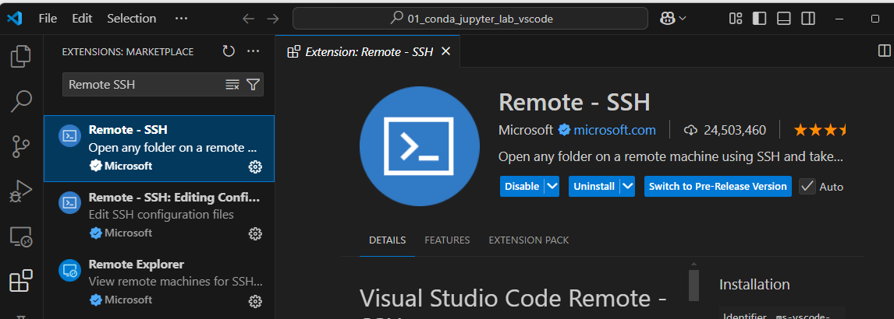

---

- Pres Ctrl + Shift + P

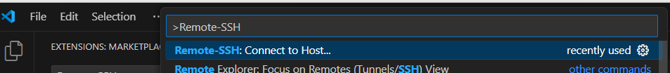

---

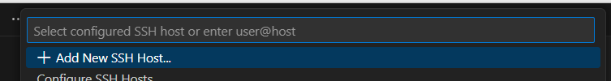

---

---

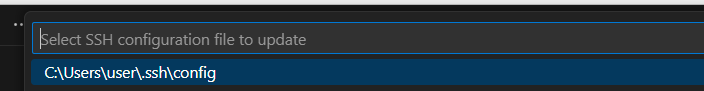

---

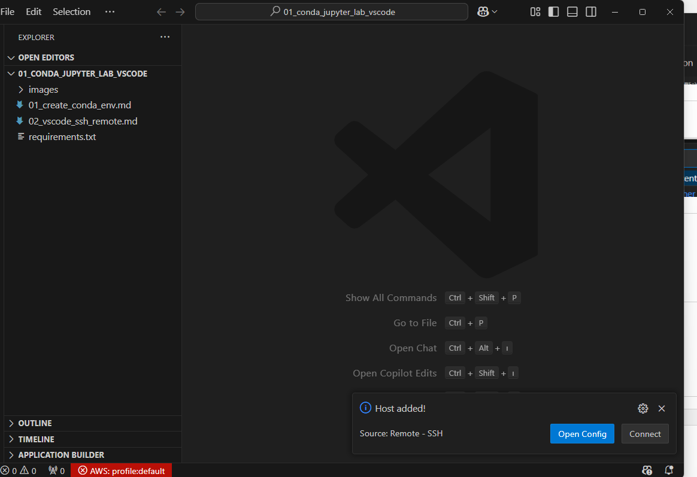

---

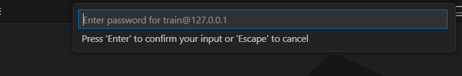
- Ankara06
---

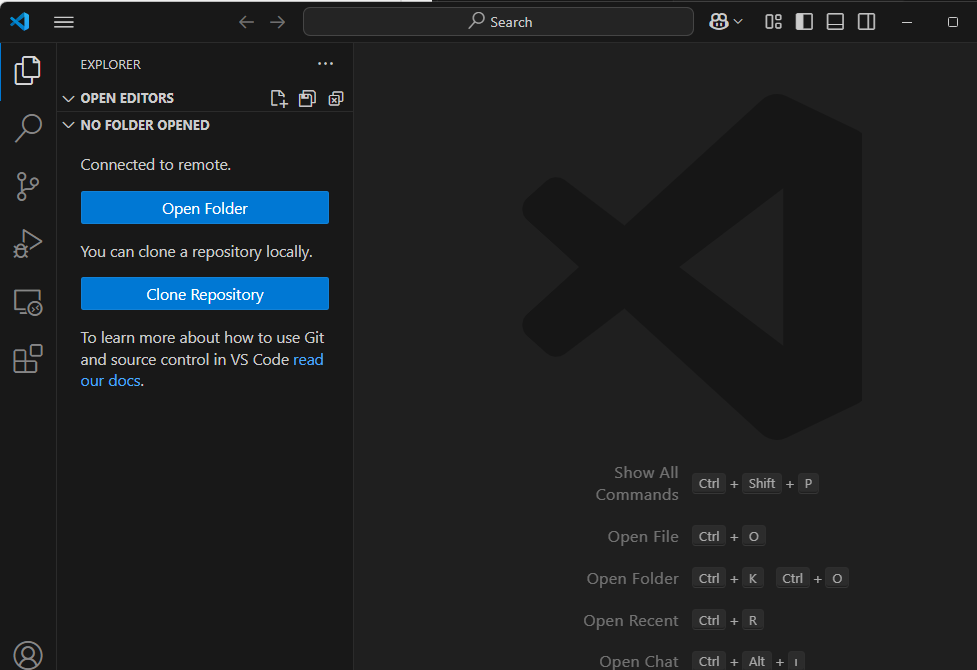

---

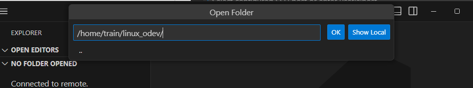

- If asks password again please enter
---

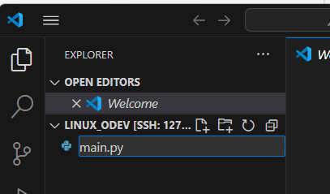

---

- Right bottom corner click python version
- Then select ds-dev miniconda interpreter

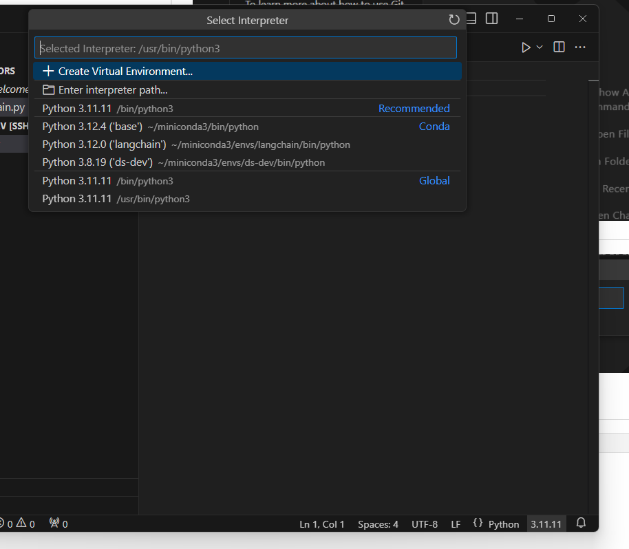

---

---

## Chage Python Locator
- File -> Preferences -> Settings

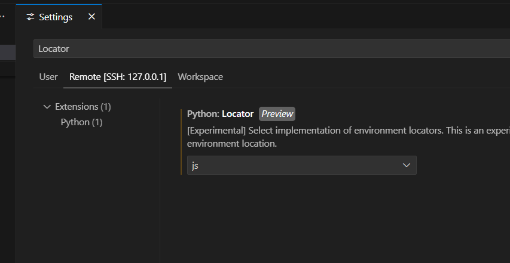

---